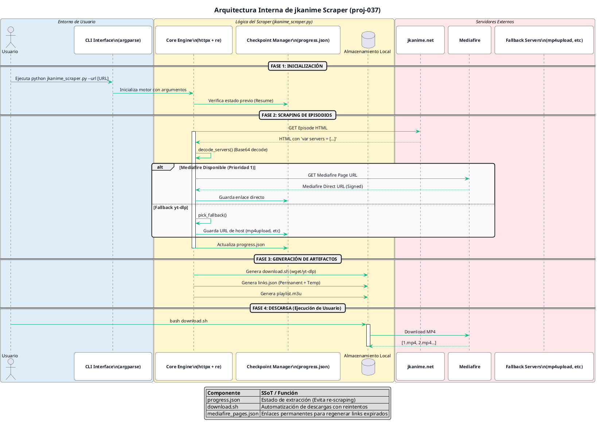

# jkanime-scraper

Browserless scraper that extracts direct download links from
[jkanime.net](https://jkanime.net) episode pages and generates a
resumable download script.

It is a **web-scraping practice project**: the episode page ships its
mirror list inline as a base64-encoded JavaScript array, so links can be
resolved with plain HTTP requests — no headless browser required.

## How it works

```
jkanime episode HTML
  └─ var servers = [...]            base64-encoded mirror list, inline in HTML
       ├─ Mediafire file page      permanent URL  (mediafire.com/file/{key}/)
       │    └─ signed direct URL   expires        (download123.mediafire.com/.../ep.mp4)
       └─ fallback host            yt-dlp target  (mp4upload, streamtape, ...)
```

1. `detect_series_info` reads the series slug from the URL and the episode
   total from the site's `ajax/episodes/{id}/1` endpoint (CSRF token pulled
   from the page `<meta>`).
2. For each episode, `process_episode` decodes the inline server list,
   prefers Mediafire, and resolves the signed direct URL from the file page.
3. When Mediafire is unavailable, it records a `yt-dlp`-compatible fallback
   host instead (priority: mp4upload → streamtape → mega → voe → mixdrop →
   doodstream).
4. `generate_download_script` emits a `download.sh` that uses `wget` for
   Mediafire direct URLs and `yt-dlp` for fallbacks, skipping files already
   present.

## Architecture

The following diagram illustrates the complete workflow of the scraper, from URL identification to artifact generation:



> **Note:** If you need to update the diagram, edit `architecture.puml` and run:
> `java -jar ~/central_command/bin/plantuml.jar -tpng architecture.puml`

| File | Lifetime | Purpose |
|------|----------|---------|
| `mediafire_pages.json` | permanent | primary recovery — regenerate signed links anytime |
| `links.json` | expires (hours) | the signed `download*.mediafire.com` URLs; use soon |

Signed links expire, so `mediafire_pages.json` is written **per episode**
(before the signed link is even fetched) and is the source of truth.

## Requirements

- Python 3.10+
- [`wget`](https://www.gnu.org/software/wget/) — Mediafire downloads
- [`yt-dlp`](https://github.com/yt-dlp/yt-dlp) — fallback-host downloads

```bash
./install.sh        # creates .venv, installs deps, checks wget/yt-dlp
```

Or manually:

```bash
python -m venv .venv
source .venv/bin/activate
pip install -r requirements.txt
```

## Usage

```bash
# Scrape a whole series (total episodes auto-detected)
python jkanime_scraper.py --url https://jkanime.net/yugioh-duel-monsters-gx/1/

# Download everything that was resolved
bash yugioh-duel-monsters-gx/download.sh

# Play in numeric order (any M3U-aware player)
mpv yugioh-duel-monsters-gx/playlist.m3u
```

Episodes are saved with plain numeric names (`1.mp4`, `2.mp4`, ...). A
`playlist.m3u` is generated in true numeric order, so playback is correct
even though a folder lists `1.mp4, 10.mp4, 2.mp4` lexically.

Manual range / explicit slug:

```bash
python jkanime_scraper.py --series yugioh-duel-monsters-gx --start 1 --end 180
```

| Flag | Default | Notes |
|------|---------|-------|
| `--url` | — | any episode URL; auto-detects slug + total |
| `--series` | — | slug, requires `--end` |
| `--start` / `--end` | `1` / total | episode range |
| `--delay-min` / `--delay-max` | `0.5` / `1.5` | random per-request delay (seconds) |

## Resuming

State lives in `{series}/progress.json` and is written after every episode.
Re-running the same command skips resolved episodes and retries the rest;
episodes that have a `mediafire_page` but no signed link are refreshed
without re-scraping jkanime.

## Output layout

```
{series}/
├── mediafire_pages.json   permanent Mediafire page URLs (primary)
├── links.json             signed direct URLs (expire)
├── progress.json          full checkpoint
├── download.sh            generated wget/yt-dlp script
├── playlist.m3u           episodes in numeric order
└── 1.mp4, 2.mp4 ...       downloaded episodes
```

## Disclaimer

For educational use. Respect jkanime.net's terms of service and only
download content you are entitled to access.
